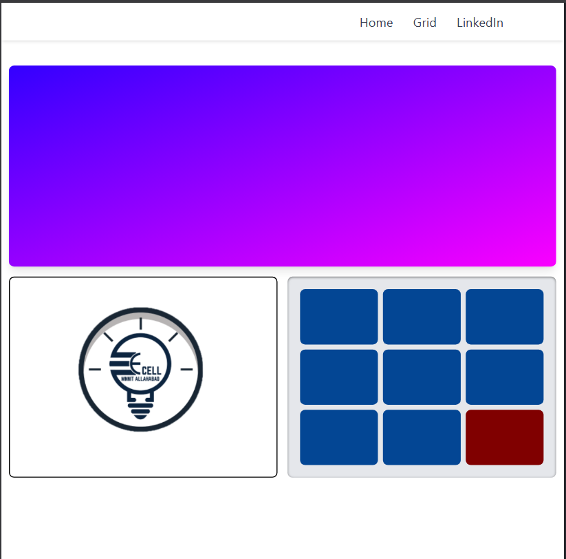

# E-Cell MNNIT Recruitment Task

A responsive React application featuring interactive components and navigation.

## Live Demo

Check out the live deployed version of this project [here](https://e-cell-task-nu.vercel.app/).

## Features

- Interactive color-changing grid puzzle
- Responsive navigation with mobile support
- Profile page with social media integration
- Modern UI with animations and transitions

## Screenshots

### Home Page


_Interactive grid puzzle and E-Cell logo display_

### Profile Grid


_Personal profile with Instagram integration_

### Tablet Responsive Design



_Mobile-friendly navigation and layout_

### Mobile Responsive Design


_Mobile-friendly navigation and layout_

## Technologies Used

- React
- React Router
- Tailwind CSS


## Setup Instructions

1. Clone the repository

```bash
git clone https://github.com/Kanishkuu/E-Cell-Task
```

2. Install dependencies

```bash
npm install
```

3. Run the development server

```bash
npm run dev
```

## Project Structure

```
frontend/
├── src/
│   ├── assets/
│   ├── components/
│   │   └── Navbar.jsx
│   ├── pages/
│   │   ├── Home.jsx
│   │   └── Grid.jsx
│   └── App.js
```

## Features Explanation

### Interactive Grid

- 3x3 grid with color-changing cells
- Click pattern memory game
- Reset functionality

### Profile Section

- Personal information display
- Instagram integration
- Animated background
- Hover effects

### Navigation

- Responsive navbar
- Smooth transitions

## Developer

- **Name**: Kanishk Kabra
- **Registration Number**: 20233154
- [LinkedIn](https://www.linkedin.com/in/kanishk-kabra-469284280/)

