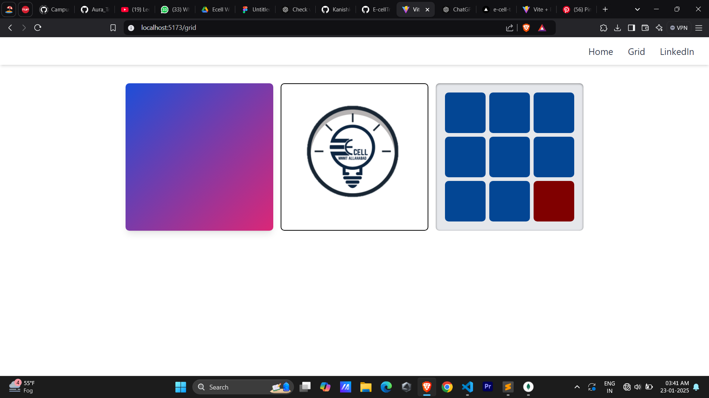
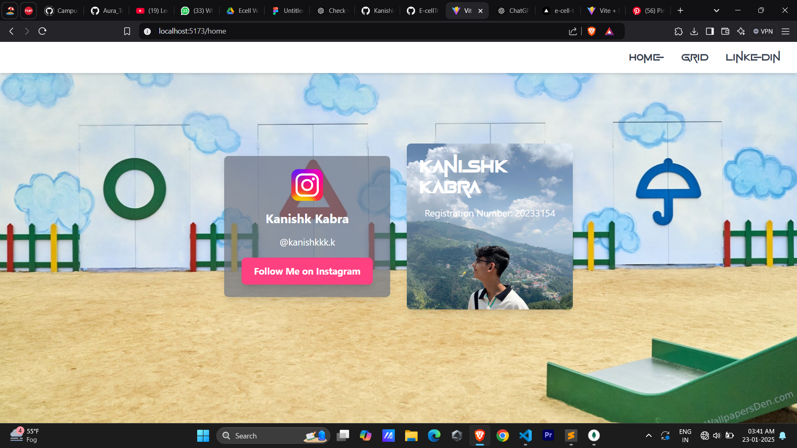
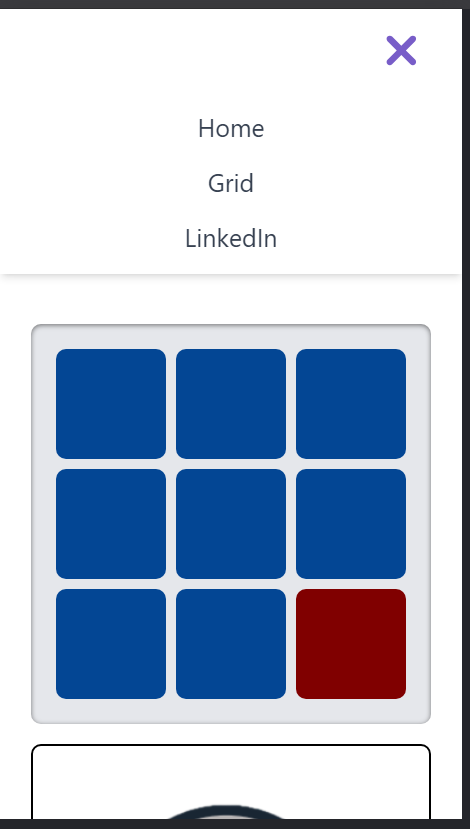

# **Squid Game Themed Profile**

A fun Squid Game-inspired profile page and Grid built with **React**.

## **Live Demo**

Check out the live version of the project: [Squid Game Themed Profile](https://e-cell-task-nu.vercel.app/).

## **Screenshots**






## **Installation**

1. Clone the repository:
   ```bash
   git clone https://github.com/yourusername/squid-game-profile.git

2. Navigate to the project directory:
   ```bash
   cd squid-game-profile

3. Install dependencies:
   ```bash
   npm install

4. Run the app locally:
   ```bash
   npm start 

## **Technologies Used**

- React
- Tailwind CSS
- Vercel for deployment


